## Table of contents

* [Overview](#overview)

* [User-Guide](#User-Guide)

* [Development History](#Development-History)

* [About the team](#About-the-team)

## Overview

The goals of the Dorm Room Cook site is to provide students with healthy and refined recipes to improve their diet, while also offering convenient ways to choose their meals by including information such as: price, time needed to prepare, and dietary restrictions. 

The website itself will have a display of all the recipes recorded on it. UH users will be able to login and create a public profile and add recipes to the website to share with others. Each recipe will provide cooking instructions and ingredients in addition to the details in the goals above. 

[Click here for the app](http://dormroomcooks.meteorapp.com/#/)

## User Guide
### Landing Page
[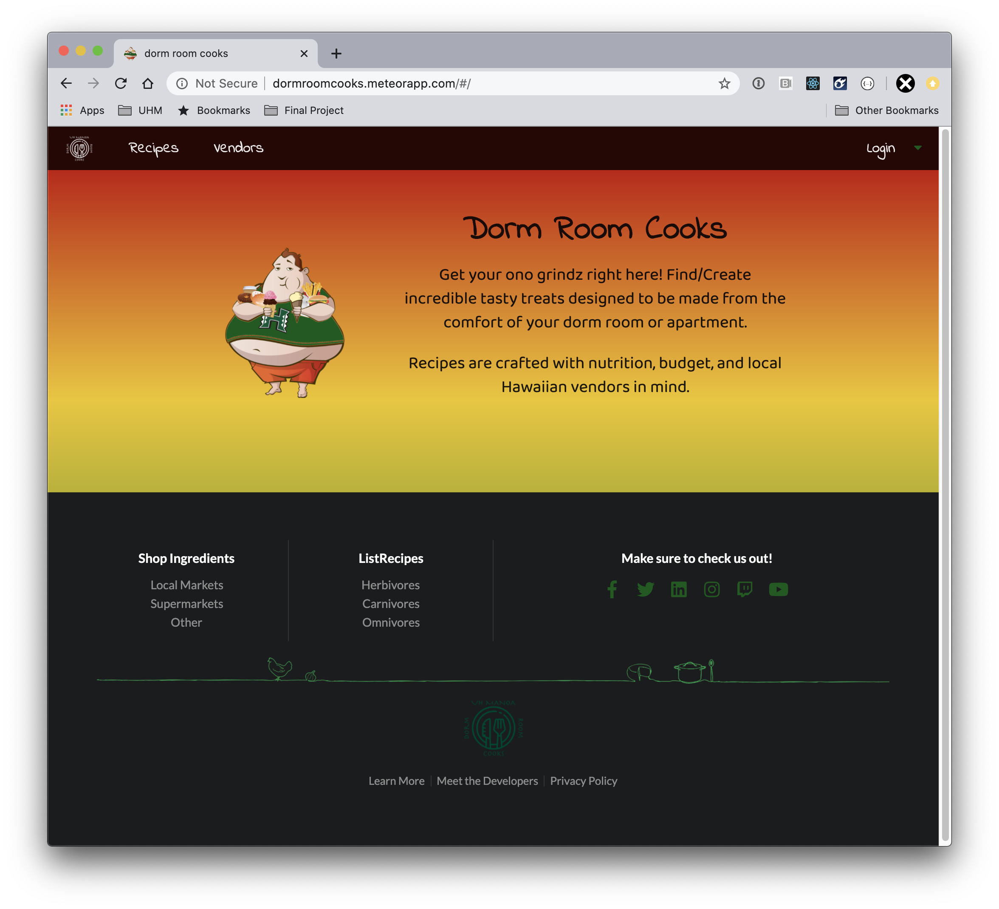](http://dormroomcooks.meteorapp.com/#/)

### List Recipes Page
[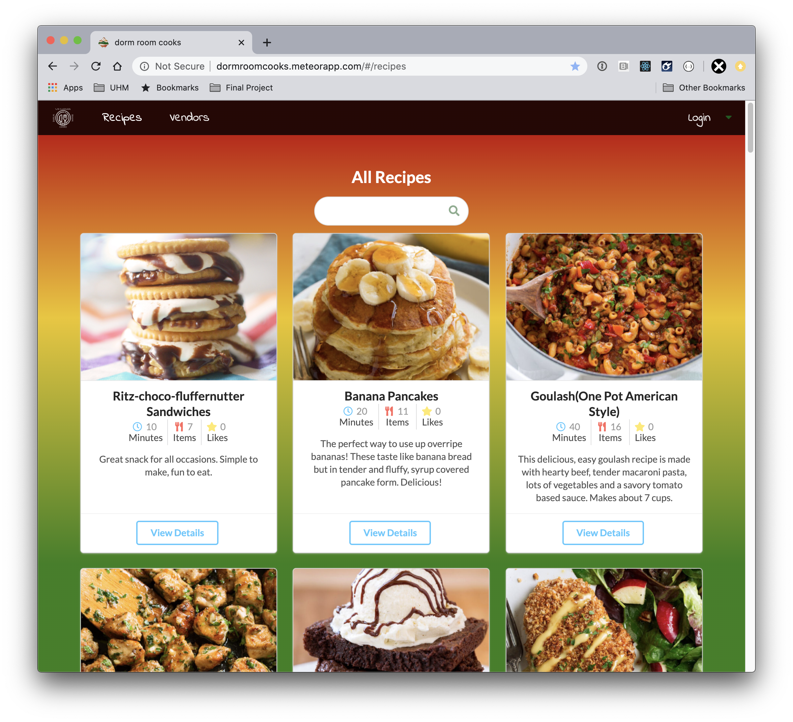](http://dormroomcooks.meteorapp.com/#/recipes)

### Add Recipe Page
[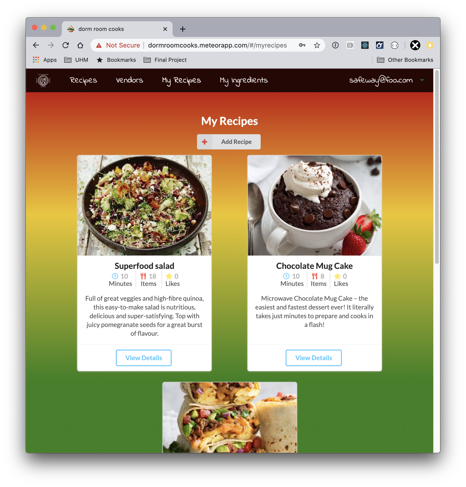](http://dormroomcooks.meteorapp.com/#/myrecipes)

### Recipe Details Modal
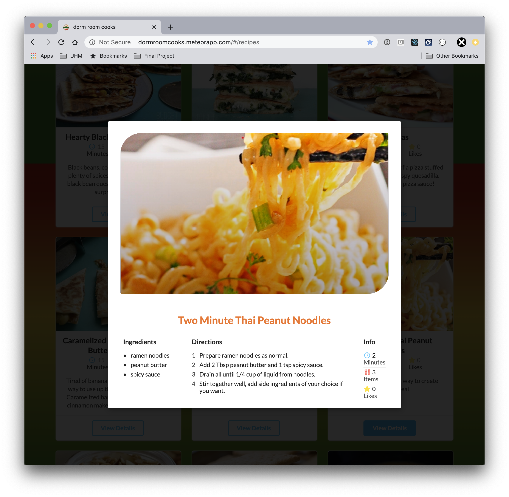

### List Vendors Page

### Vendors Landing
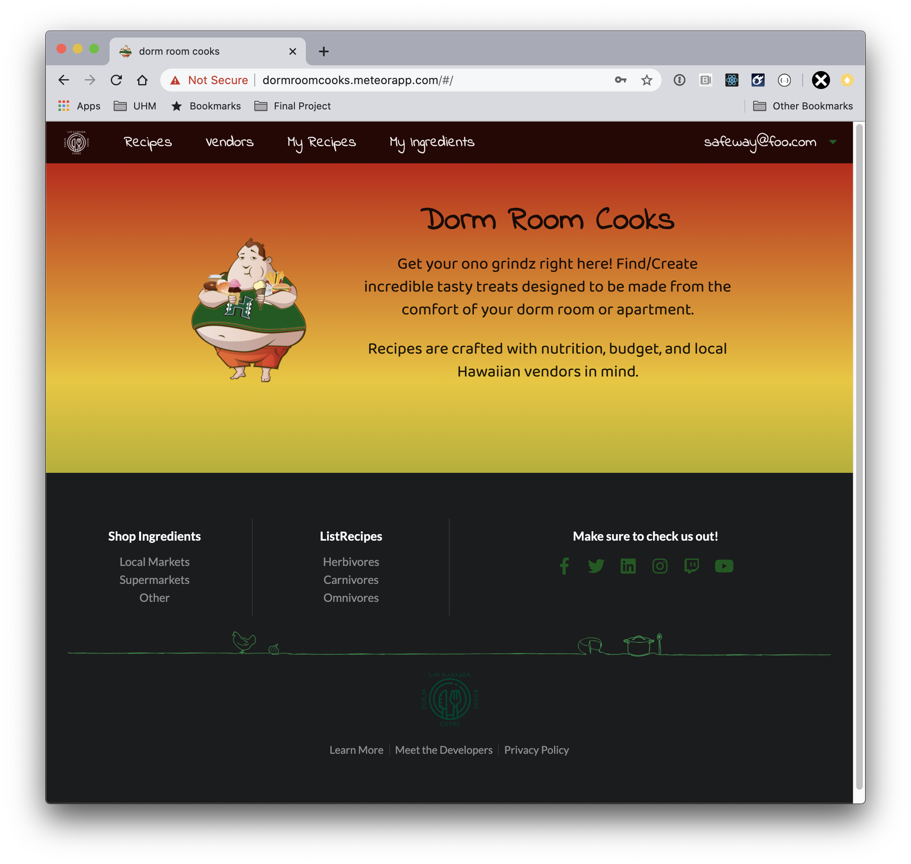

### My Vendor Items Page
[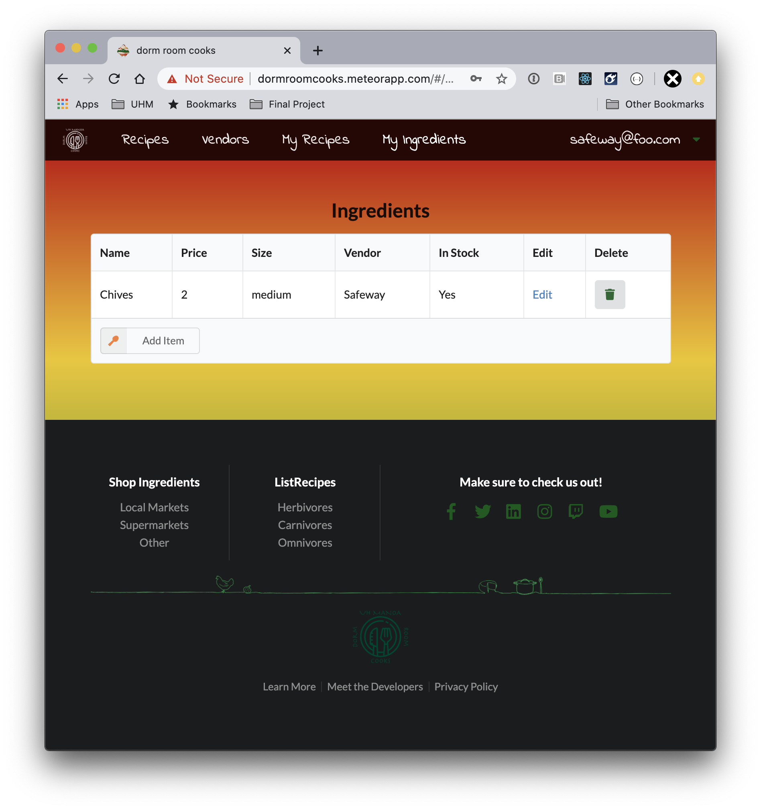](http://dormroomcooks.meteorapp.com/#/myitems)

### Add Vendor Items Modal
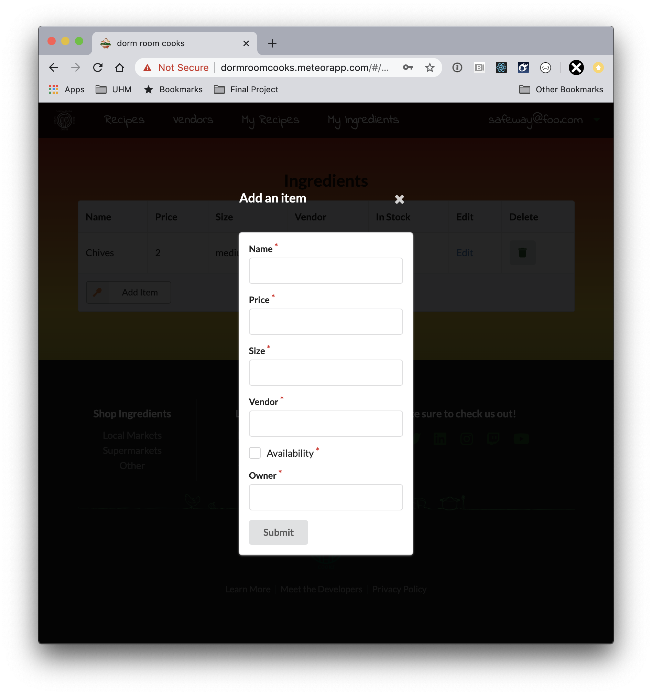

### Edit Item Page
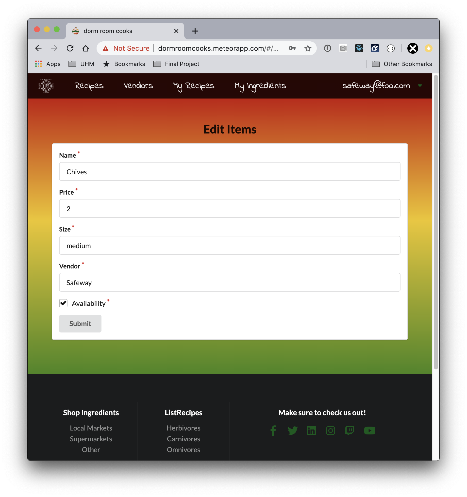

### About Us Modal
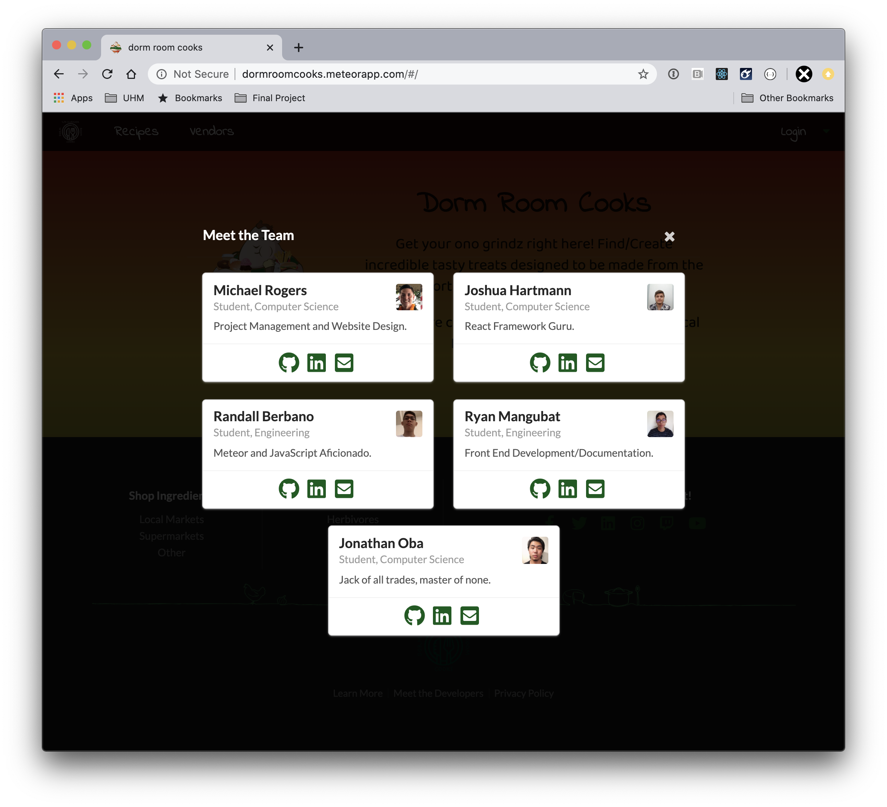

## Development-History

### M1 Project Page

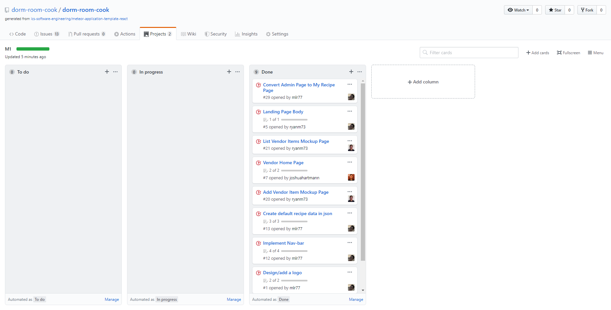

[Click here to see the M1 Project Page](https://github.com/dorm-room-cook/dorm-room-cook/projects/1)

### M2 Project Page

M2 was focused on adding functionality to our recipes and vendors pages. Nearly 60 recipes and 15 unique vendors have been added to show realistic data. 

As a side note the app has been redesigned to support mobile devices with fully responsive pages. 

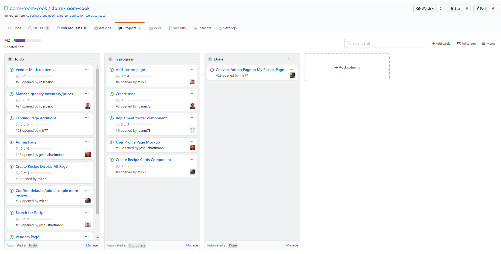

[Click here to see the M2 Project Page](https://github.com/dorm-room-cook/dorm-room-cook/projects/2)

### M3 Project Page

[Click here to see the M3 Project Page](https://github.com/dorm-room-cook/dorm-room-cook/projects/2)

## About-the-team
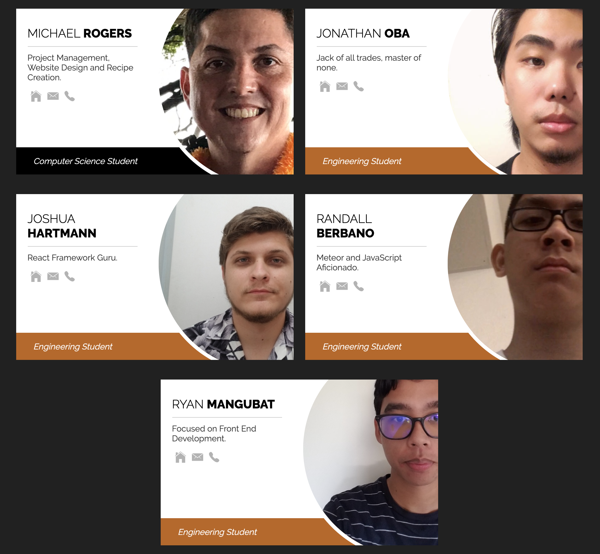

