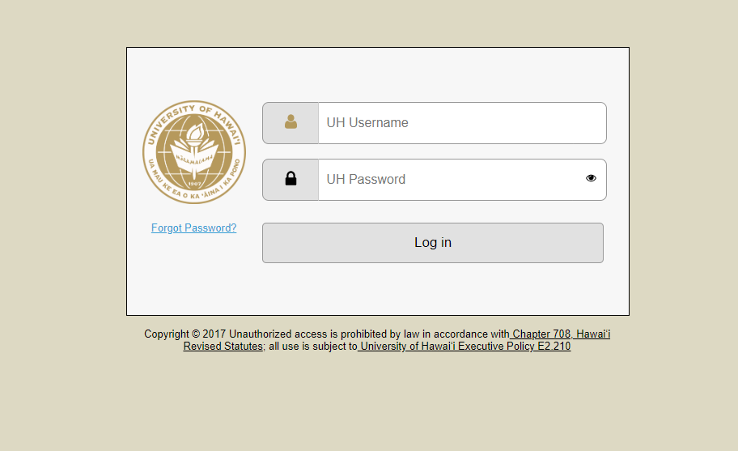
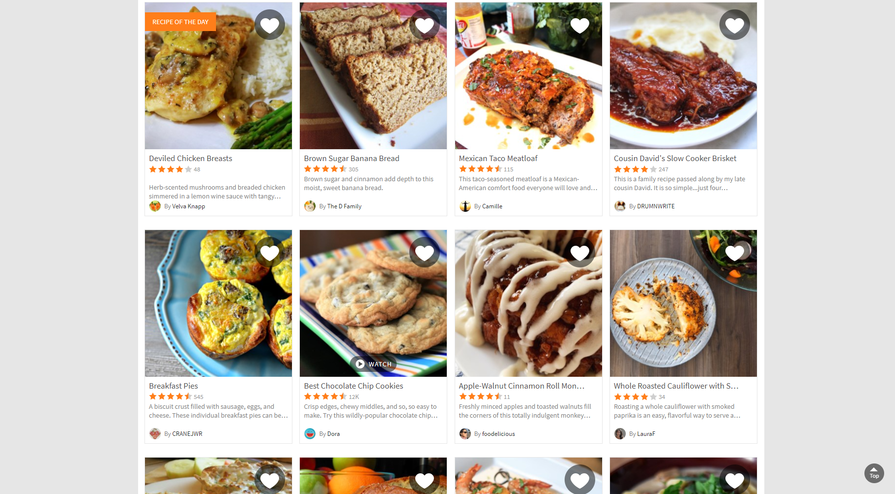
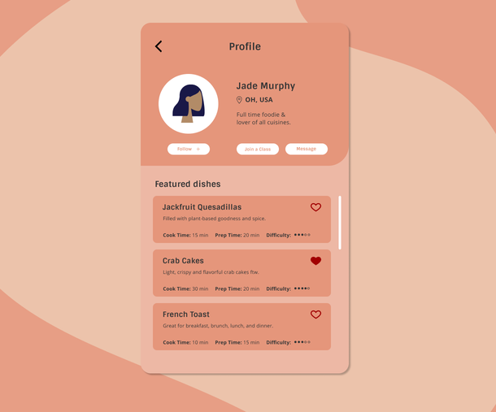

## Table of contents

* [Overview](#overview)
* [Inspirations](#Inspirations)

## Overview

The goals of the Dorm Room Cook site is to provide students with healthy and refined recipes to improve their diet, while also offering convenient ways to choose their meals by including information such as: price, time needed to prepare, and dietary restrictions. 

The website itself will have a display of all the recipes recorded on it. UH users will be able to login and create a public profile and add recipes to the website to share with others. Each recipe will provide cooking instructions and ingredients in addition to the details in the goals above. 

## Inspirations
Below will be screenshots of varying websites that will be used as a basis for Dorm Room Cook

