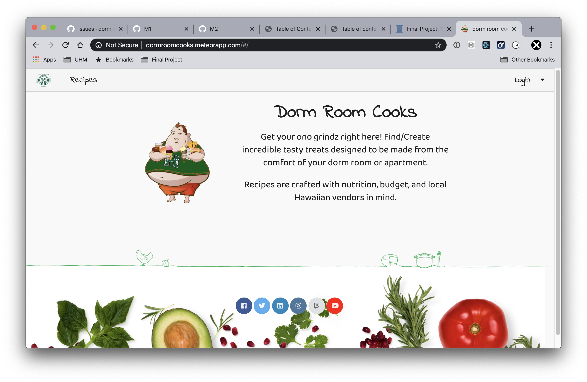
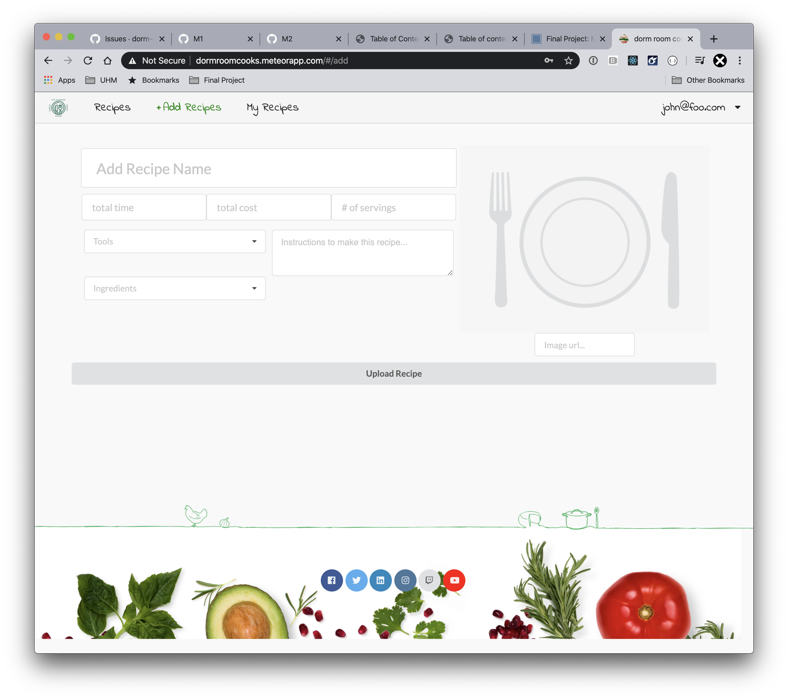
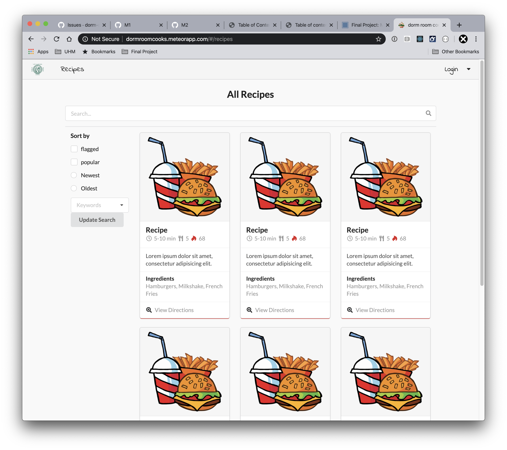
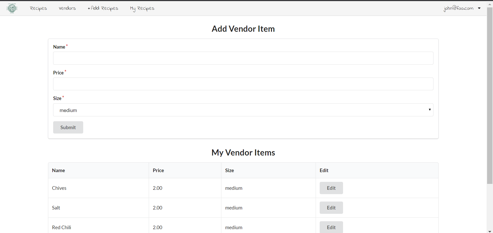
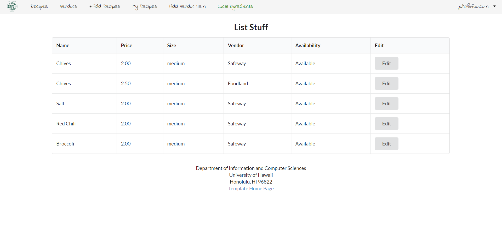

## Table of contents

* [Overview](#overview)

* [Mockup-Pages](#Mockup-Pages)

* [Development History](#Development-History)

* [About the team](#About-the-team)

## Overview

The goals of the Dorm Room Cook site is to provide students with healthy and refined recipes to improve their diet, while also offering convenient ways to choose their meals by including information such as: price, time needed to prepare, and dietary restrictions. 

The website itself will have a display of all the recipes recorded on it. UH users will be able to login and create a public profile and add recipes to the website to share with others. Each recipe will provide cooking instructions and ingredients in addition to the details in the goals above. 

[Click here for the app](http://dormroomcooks.meteorapp.com/#/)

## Mockup-Pages
### Landing Page

### Add Recipe Page

### List Recipes Page

### Add Vendor Item Page

### List Vendor Items Page

## Development-History

### M1 Project Page

[Click here to see the M1 Project Page](https://github.com/dorm-room-cook/dorm-room-cook/projects/1)

### M2 Project Page

[Click here to see the M2 Project Page](https://github.com/dorm-room-cook/dorm-room-cook/projects/2)

## About-the-team

